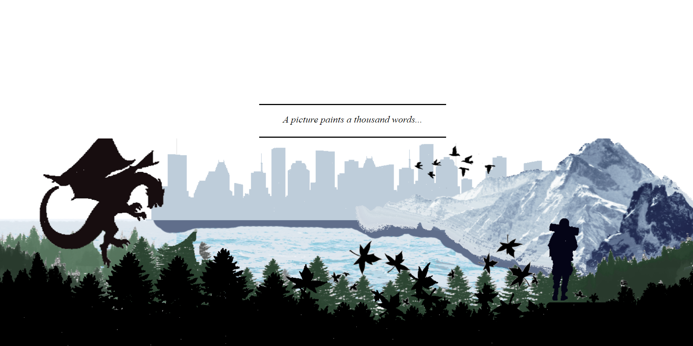
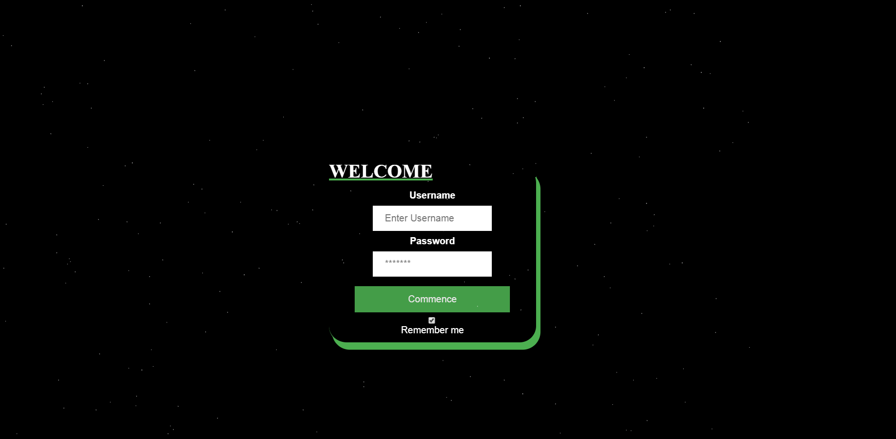
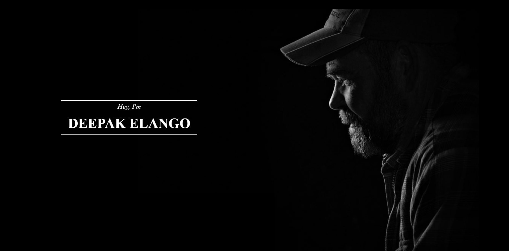
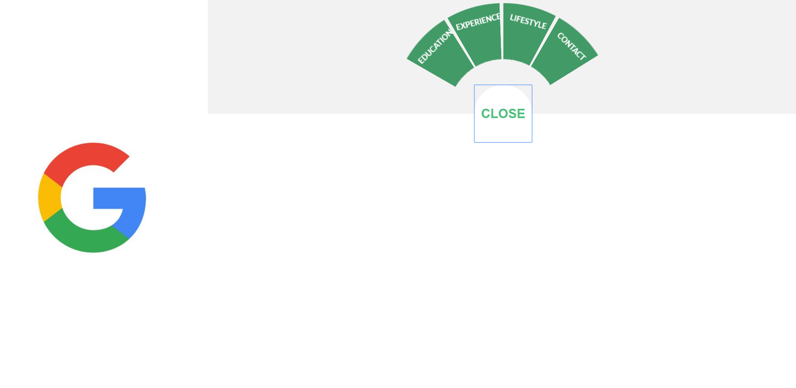
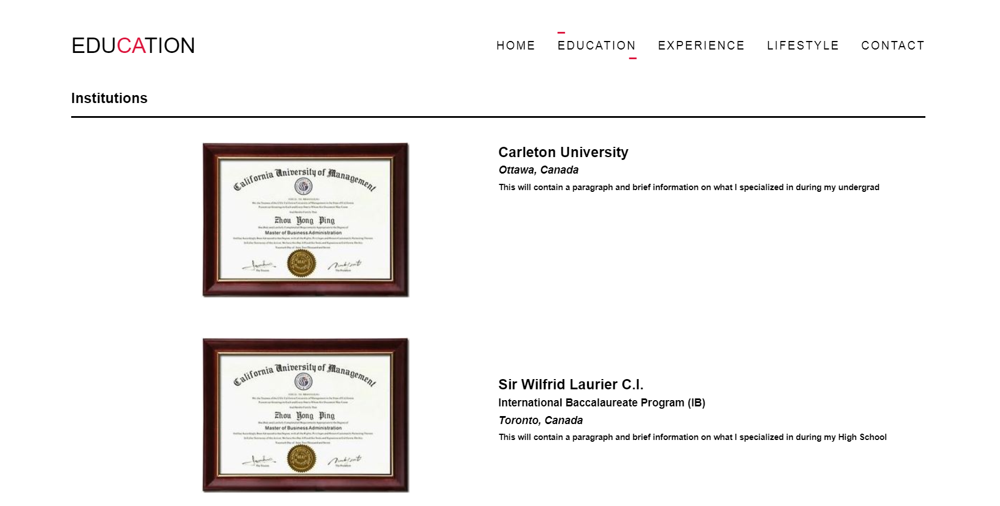
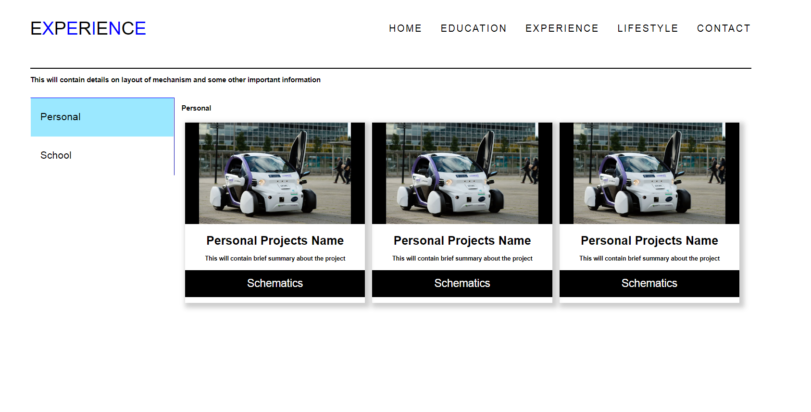
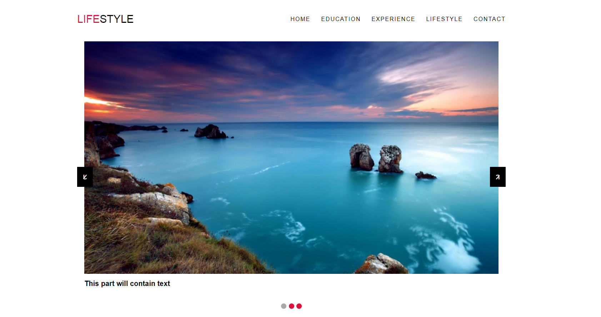
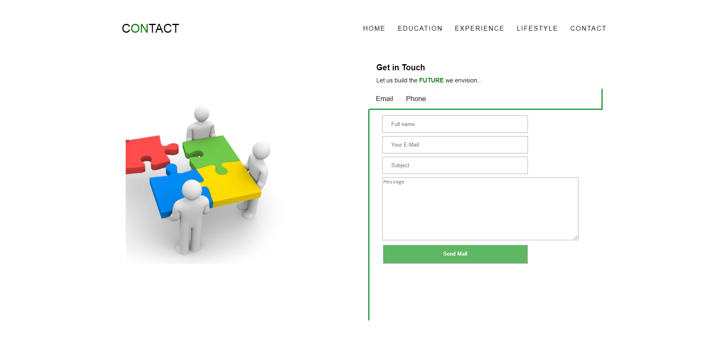

# Project-Virtual-Resume
This website will feature a virtual resume that can only be accessed by potential employers that I will give access to

Note that this is version 1 of the website [Jan 21/2020]
All supporting licenses from supporting libraries will be added in the near future with the release of version 2
Version 2 will also encompass comments to make code more user friendly

Below you will find snippets of how the website is, note that there are many other features that are omitted from the pictures, 
for example the login page consists of these dots that move from the bottom of the page to the top but in the picture it shows it frozen 

Login Page (index.html)

Home Page

Education

Experience

Lifestyle

Contact

